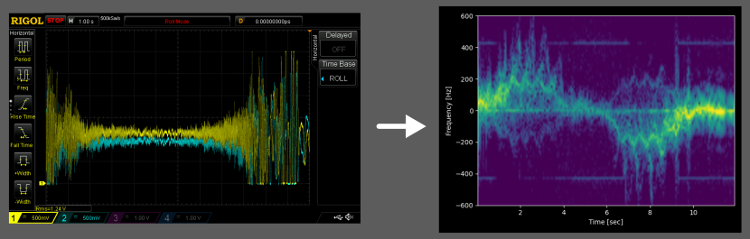

# ds1000z-tools

Faster data export for Rigol DS1000Z oscilloscopes.



This package contains tools for downloading data and screenshots from Rigol
DS1000Z series oscilloscopes over a network. Features:

- save data (both on-screen, and the full memory depth) to numpy data files (.npy)

- save screenshots in PNG format

- reliable and fast auto-discovery (does not use zeroconf)

- It's not slower than it should be -- screenshots take 1 second, saving the full memory takes 30 seconds

## usage

```bash
# save screen, automatic filename
ds1000z-tools save-screen
# specify filename
ds1000z-tools save-screen screenshot.png

# save full data, automatic filename
ds1000z-tools save-data
# specify filename
ds1000z-tools save-data data.npy
# save on-scren data
ds1000z-tools save-data --screen  # or -s
# save specific channels
ds1000z-tools save-data --channels 1,3  # or -c

# specify host to connect to
ds1000z-tools --address scope.lan save-data  # or -a
```

For more detail and options, see:

```bash
ds1000z-tools --help
ds1000z-tools save-screen --help
ds1000z-tools save-data --help
```

## installation

    python -m pip install git+https://github.com/tomjnixon/ds1000z-tools.git

You'll need a recent python 3 install.

## data formats

Currently only numpy (.npy) binary files are supported.

This contains a dictionary, where the keys are the channel names, and the
values are a tuple containing the metadata (called the preamble in the
[programming guide]), and the data. It can be loaded like this:

```python
>>> import numpy as np
>>> d = np.load("data.npy", allow_pickle=True)[()]
>>> pprint(d)
{'CHAN1': ({'count': 1,
            'format': 'BYTE',
            'points': 5999968,
            'type': 'RAW',
            'xincrement': 1e-06,
            'xorigin': -3.0,
            'xreference': 0,
            'yincrement': 0.02628906,
            'yorigin': -57.0,
            'yreference': 96},
           array([1.4458983, 1.4458983, ..., 1.3407421], dtype=float32)),
 'CHAN2': ({'count': 1,
            'format': 'BYTE',
            'points': 5999968,
            'type': 'RAW',
            'xincrement': 1e-06,
            'xorigin': -3.0,
            'xreference': 0,
            'yincrement': 0.02666016,
            'yorigin': -56.0,
            'yreference': 95},
           array([0.8531251 , 0.8531251, ..., 0.74648446], dtype=float32))}
```

The data from channel 1 would then be `d["CHAN1"][1]`. The sample times can be
derived from the xorigin and xincrement (again, see the [programming guide] for
specifics).

## support

So far this has only been tested on my DS1054Z, on my network, on linux, but
should work with any DS1000Z-series oscilloscope. If it doesn't work for you,
or does work with another oscilloscope, please open an issue.

Planned features are collected in the issues. I'm open to adding more, but am
not interested in adding lots of control and configuration commands -- for
scripting you're better off just using [pyvisa] directly and
[reading the manual][programming guide].

## why?

Ultimately I couldn't find anything that works the way I wanted. I've used
[da1054z](https://github.com/pklaus/ds1054z) for years to take screenshots as
part of project documentation/notes. It still works OK, but taking 10 minutes
to save data pushed gave me the necessary impetus to write this, and make it
work exactly how I wanted.

[pyvisa]: https://github.com/pyvisa/pyvisa
[programming guide]: https://beyondmeasure.rigoltech.com/acton/attachment/1579/f-0386/1/-/-/-/-/DS1000Z_Programming%20Guide_EN.pdf
